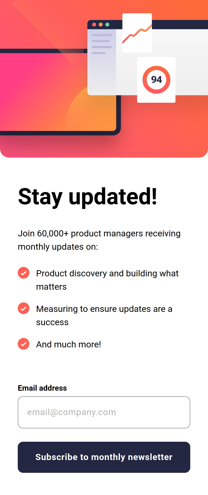
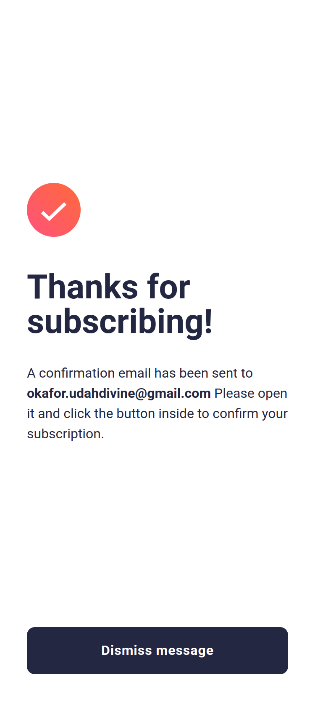
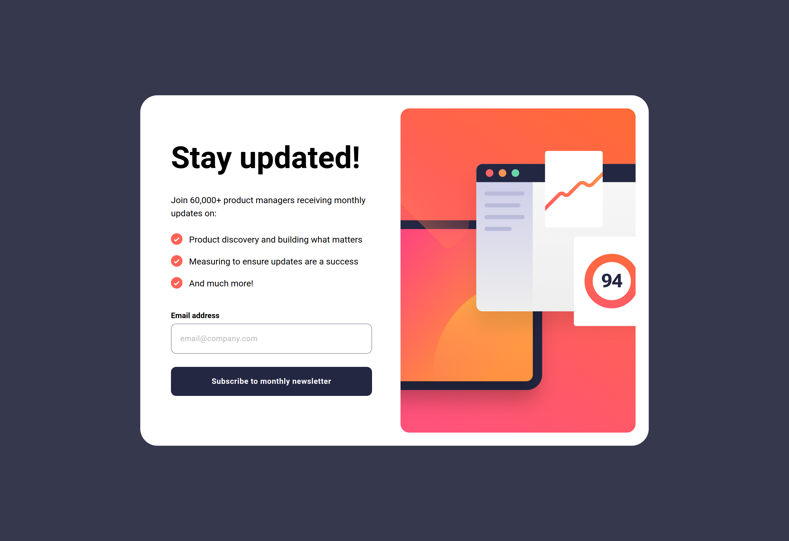
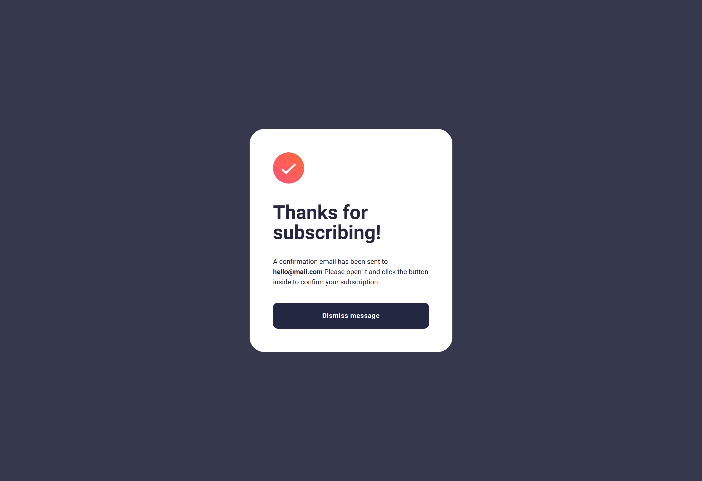
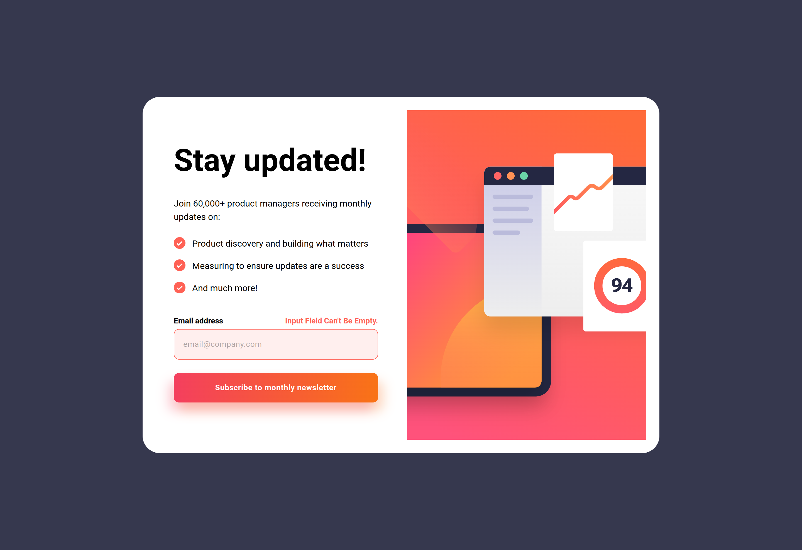
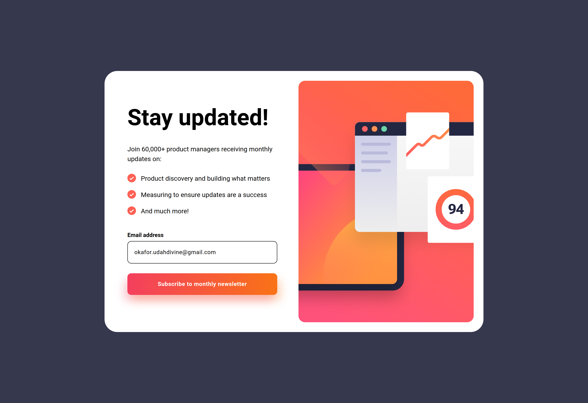
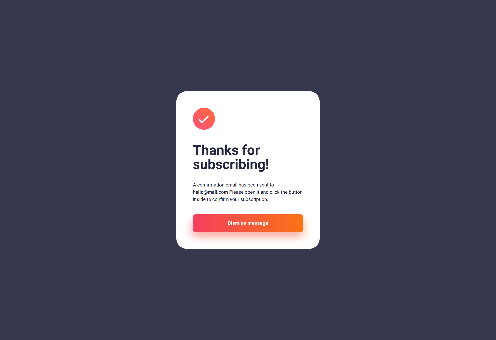

# Frontend Mentor - Newsletter sign-up form with success message solution

This is a solution to the [Newsletter sign-up form with success message challenge on Frontend Mentor](https://www.frontendmentor.io/challenges/newsletter-signup-form-with-success-message-3FC1AZbNrv). Frontend Mentor challenges help you improve your coding skills by building realistic projects. 

## Table of contents

- [Overview](#overview)
  - [The challenge](#the-challenge)
  - [Screenshot](#screenshot)
  - [Links](#links)
- [My process](#my-process)
  - [Built with](#built-with)
  - [What I learned](#what-i-learned)
  - [Continued development](#continued-development)
  - [Useful resources](#useful-resources)
- [Author](#author)
- [Acknowledgments](#acknowledgments)

## Overview

### The challenge

Users should be able to:

- Add their email and submit the form
- See a success message with their email after successfully submitting the form
- See form validation messages if:
  - The field is left empty
  - The email address is not formatted correctly
- View the optimal layout for the interface depending on their device's screen size
- See hover and focus states for all interactive elements on the page

### Screenshots
<figure style="width:270px">
  
  <figcaption style="text-transform:Capitalize; background:rgba(255,255,255,0.1); padding: 8px">mobile screen</figcaption>
</figure>
 
 
<figure style="width:270px">
  
  <figcaption style="text-transform:Capitalize; background:rgba(255,255,255,0.1); padding: 8px">mobile success screen</figcaption>
</figure>
 
 
<figure>
  
  <figcaption style="text-transform:Capitalize; background:rgba(255,255,255,0.1); padding: 8px">desktop screen</figcaption>
</figure>
 
 
<figure>
  
  <figcaption style="text-transform:Capitalize; background:rgba(255,255,255,0.1); padding: 8px">desktop success screen</figcaption>
</figure>
 
 
<figure style="width:100%">
  
  <figcaption style="text-transform:Capitalize; background:rgba(255,0,0,0.1); padding: 8px">invalid email error</figcaption>
</figure>
 
 
<figure style="width:100%">
  
  <figcaption style="text-transform:Capitalize; background:rgba(255,0,0,0.1); padding: 8px">input field error</figcaption>
</figure>
 
 
<figure style="width:100%">
  
  <figcaption style="text-transform:Capitalize; background:rgba(0,255,0,0.1); padding: 8px">input field active</figcaption>
</figure>
 
 
<figure style="width:100%">
  
  <figcaption style="text-transform:Capitalize; background:rgba(0,255,0,0.1); padding: 8px">button active</figcaption>
</figure>

### Links

- Solution URL: [Repo](https://github.com/Deeokafor/fm-newsletter-sign-up-with-success-message-main)
- Live Site URL: [https://github.com/Deeokafor/fm-newsletter-sign-up-with-success-message-main](https://github.com/Deeokafor/fm-newsletter-sign-up-with-success-message-main)

## My process

### Built with

- Semantic HTML5 markup
- CSS custom properties
- Flexbox
- Mobile-first workflow
- [Tailwindcss](https://tailwindcss.com/) - css utility-first framework
- ES6 (Javascript version 2015)

### What I learned

- I had to refresh my memory on how html & css file paths worked. I had to learn that using relative paths is more production friendly than absolute paths... a change in directory could cause paths to fail.

### Continued development

Henceforth, I am focusing on writing UI's which pass accessibilty tests and Semantic-ui's.
### Useful resources

- [Tailwindcss Docs](https://www.tailwindcss.com) - having to refer to the detailed docs here when in a tight spot was so helpful.

- [w3schools](https://www.w3schools.com/cssref/css3_pr_align-self.php) - At some point in the project, I was stumped with properly aligning the elements for the `mobile-success-screen` but a little bit of practise on `align-self` rules in css, here, helped me to overcame that challenge in Tailwindcss.

## Author

- Website - [Okafor-udah Divine Chukwunwemmeri](https://deedev.netlify.app/)
- Frontend Mentor - [@Deeokafor](https://www.frontendmentor.io/profile/Deeokafor)
- Twitter - [@dee_okafor](https://www.twitter.com/dee_okafor)

## Acknowledgments

- I am thankful to [Google Search](google.com) :). 
